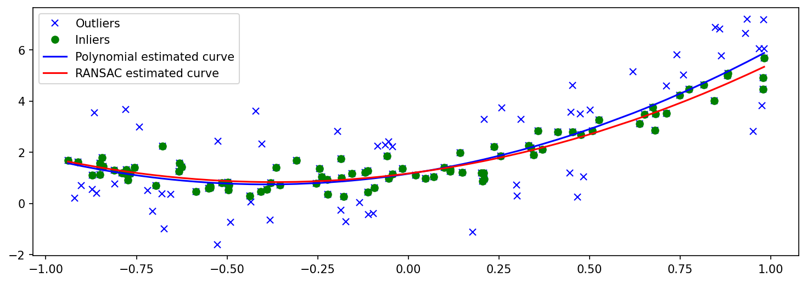
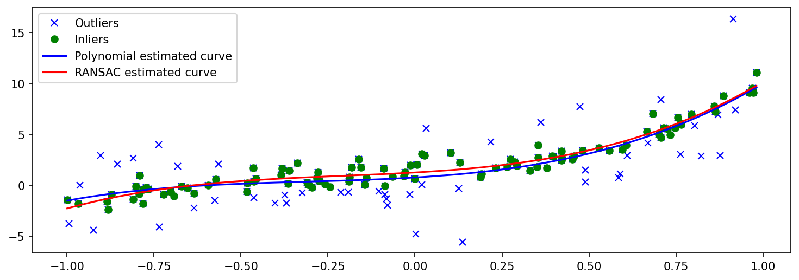
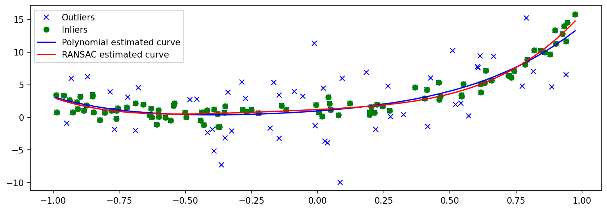

# Robust Regression for Curve Fitting ⭐

Robust regression is a type of regression analysis in robust statistics that is intended to overcome some of the limitations of traditional parametric and non-parametric methods. The goal of regression analysis is to determine the relationship between one or more independent variables and one or more dependent variables. 

Certain commonly used regression methods, such as ordinary least squares, have favourable properties when their underlying assumptions are true, but can produce misleading results when those assumptions are violated; thus, ordinary least squares is said to be not robust to assumptions violations. Least squares estimates for regression models, in particular, are extremely sensitive to outliers. While no precise definition exists, outliers are observations that do not follow the pattern of the other observations. 

This is not normally a problem if the outlier is simply an extreme observation drawn from the tail of a normal distribution; however, if the outlier is the result of non-normal measurement error or some other violation of standard ordinary least squares assumptions, the validity of the regression results is jeopardised if a non-robust regression technique is used.

## Implementation Details 🔥

### What is Linear Regression?

Linear regression is a linear approach for modelling the relationship between a scalar response and one or more dependent/independent variables. It is a commonly used type of predictive analysis. It attempts to model the relationship between variables by fitting a linear equation to observed data

The aim of any linear regression task is to: 

*   Find out if a set of predictor variables do are able to predict the outcome of a dependent variable decently or not.
*   Adjust the predictor variables depending on their significance on the dependent variable 

The regression estimates are then used to explain the relationship between one dependent variable and one or more independent variables.  The simplest form of the regression equation is with one dependent and one independent variable. It is defined as y = a*x + b, y is the dependent variable, a, b are the regression coefficients, and x is the dependent variable. 

### Why RANSAC?

Least squares estimates for regression models are extremely sensitive to outliers. These outliers are observations that do not follow the pattern of the other observations. They can be thought of as a noise in some sense, as they are feature defining values in the outcome. If the outliers voilate some of the standard ordinary least squares assumptions, the validity of the regression results is jeopardised. This is where a need for a robus regression arises. 

Random sample consensus (RANSAC) is an iterative method used to estimate parameters of a mathematical model from a set of observed data that contains outlier. It is a robust regression technique in the sense that the outliers does not affect the output of the algorithm. Where as a standard regression technique will produce misleading results.

### How does RANSAC help curve fitting?

In layman terms, RANSAC tries to demarcate between the, so-called, inliers (data whose distribution can be explained by some set of model parameters, though may be subject to noise) and outliers (which are data that do not fit the model) by repeatedly and randomly sub-sampling the points from the data. The number of times this step is repeated depends on the stopping probability provided. Firsly model parameters are estimated using the sample points only, and then the entire data is checked, if it fits that model or not. A data point will be consided an outlier if it does not fit the system, even after considering some threshold value. 

By doing so the algorithm will eventually come across the right set of data points, and thus determine the inliers and the outliers along with the correct fit. 

## Results :bar_chart:

### 2nd Order

Beta Values:  [2.47075953 1.82404132 1.17124553]

Best least square error:  0.20691632256573464

 

### 3rd Order

Beta Values:  [4.25021829 2.67019555 1.95150951 1.28776297]

Best least square error:  0.7598863911222009

 

### 4th Order

Beta Values:  [6.45826409 4.47154354 1.81991654 1.96950278 1.19897157]

Best least square error:  1.0387118261420636

 

## Instructions to Run :runner:

* The dataset is being downloaded from the given hashed link. However if at a later point of time, the dataset is not available in the input file, kindly use the image dataset present in the repository in place of the downloaded data. 

* To run, open the python notebook file and select the corresponding order data. Then run the corresponding cells to get the results

## References and Credits 💳

1. https://en.wikipedia.org/wiki/Linear_regression
2. https://en.wikipedia.org/wiki/Random_sample_consensus
3. https://en.wikipedia.org/wiki/Robust_regression

